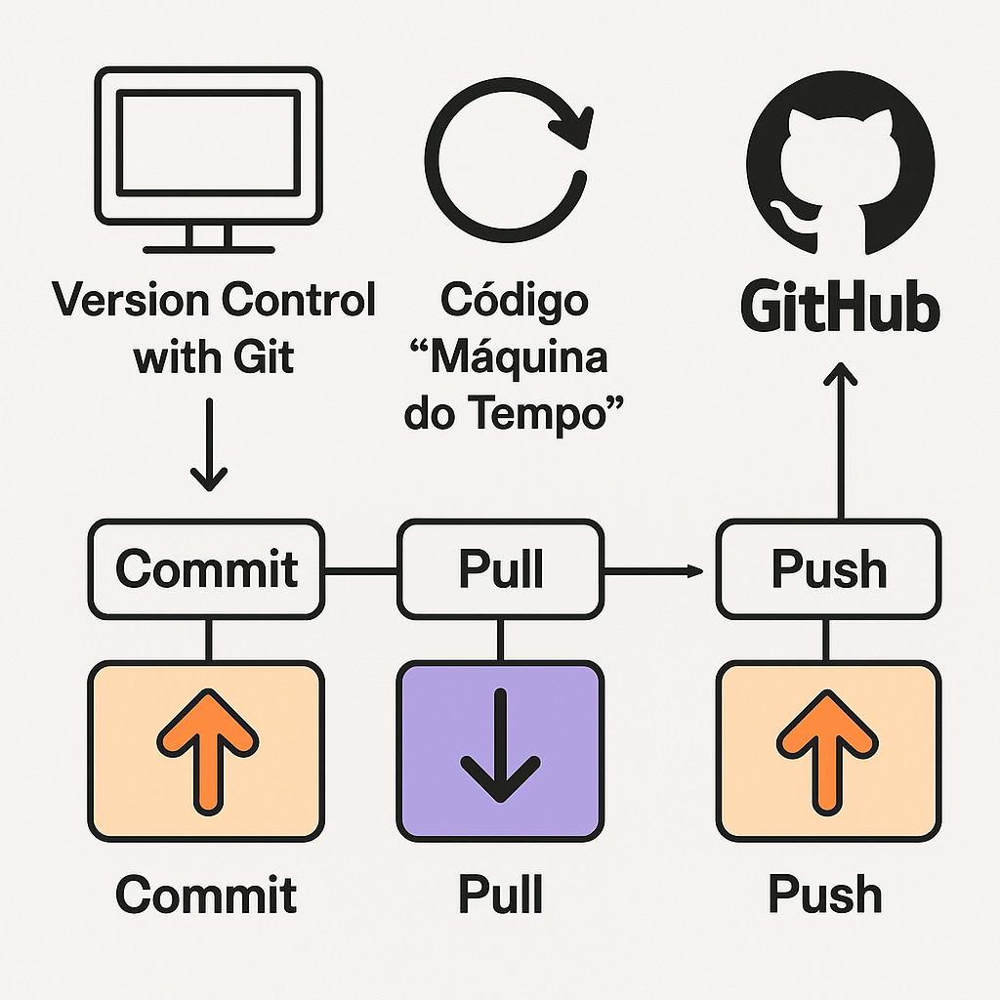

<h1 style="
    font-family: 'Orbitron', sans-serif;
    font-size: 40px;
    display: flex;
    align-items: center;
    justify-content: center;
    gap: 10px;
">
    <span style="color: #ff4500; text-shadow: 0 0 5px #ff4500, 0 0 10px #ff4500, 0 0 20px #ff4500, 0 0 40px #ff4500, 0 0 80px #ff4500;">
        GIT
    </span>
    <span style="color:rgb(255, 196, 0); text-shadow: 0 0 5px #ff4500, 0 0 10px #ff4500, 0 0 20px #ff4500, 0 0 40px #ff4500, 0 0 80px #ff4500;">
      &
    </span>
    <span style="color: #00bfff; text-shadow: 0 0 5px #00bfff, 0 0 10px #00bfff, 0 0 20px #00bfff, 0 0 40px #00bfff, 0 0 80px #00bfff;">
        GITHUB
    </span>
</h1>

## O que é o Git?
O Git é um sistema de controle de versão distribuído usado para rastrear mudanças no código-fonte durante o desenvolvimento de software. Ele permite que desenvolvedores colaborem em projetos de maneira eficiente, mantendo um histórico claro e organizado de todas as alterações feitas no código.

Podemos pensar no Git como uma "máquina do tempo" para projetos de software, onde é possível:
- **Voltar no tempo** e recuperar versões anteriores do código.
- **Anotar modificações** feitas ao longo do tempo.
- **Desfazer alterações** que deram errado.

## O que é o GitHub?
O GitHub é uma plataforma online que hospeda repositórios Git, facilitando a colaboração em projetos de software de forma remota. Ele adiciona recursos adicionais, como:
- Interface gráfica para visualizar projetos.
- Ferramentas para discutir e revisar código.
- Controle de permissões e gerenciamento de projetos colaborativos.

<p align="center">
  
</p>

## Termos Importantes e Conceitos

### Repositório (Repository)
Um repositório é um diretório ou pasta que armazena todos os arquivos relacionados ao seu projeto, juntamente com o histórico completo de alterações realizadas.

### Commit
Um commit é como um "snapshot" do seu projeto em um determinado momento. Ele armazena todas as alterações realizadas desde o último commit e adiciona uma mensagem descritiva para facilitar o entendimento posterior.
- Comando: `git commit -m "mensagem do commit"`

### Push
O comando `push` envia os commits feitos localmente para um repositório remoto (por exemplo, GitHub).
- Comando: `git push`

### Pull
O comando `pull` é utilizado para atualizar o repositório local com as últimas alterações realizadas no repositório remoto.
- Comando: `git pull`

### Pull Request
Uma pull request é uma proposta de alteração em um repositório remoto. É utilizada quando você deseja que suas mudanças sejam revisadas e integradas ao código principal.

### Merge
Merge é o processo de combinar as alterações de uma branch com outra. Geralmente, o merge é feito da branch que contém as alterações para a branch principal (`main` ou `master`).
- Comando: `git merge nome-da-branch`

### Issue
Uma issue é um tópico de discussão ou problema aberto em um repositório. Pode ser usada para rastrear bugs, sugerir melhorias ou discutir novas funcionalidades.

### GitHub Pages
GitHub Pages é uma ferramenta integrada ao GitHub que permite hospedar websites diretamente a partir do seu repositório, facilitando a publicação rápida e gratuita de páginas web.

### GitHub Actions
GitHub Actions é um sistema de integração contínua e automação dentro do GitHub, permitindo automatizar fluxos de trabalho como testes, deploy e outras tarefas de manutenção.

### Padrões de Commit
Usar padrões nos commits ajuda a manter um histórico organizado. Dois padrões comuns são:
- `[FEATURE]`: Indica que uma nova funcionalidade foi adicionada. Ex.: `[FEATURE] Add login system`
- `[FIX]`: Indica que um problema/reparo ou bug foi corrigido. Ex.: `[FIX] Resolve login bug`

### GitHub Desktop
GitHub Desktop é uma aplicação gráfica fácil de usar que facilita interagir com Git e GitHub sem a necessidade de comandos de terminal. Ele permite:
- Visualizar e gerenciar commits.
- Criar e alternar branches facilmente.
- Fazer merges visuais.
- Subir e baixar atualizações rapidamente.

## Principais Comandos Git
```bash
# Inicializar um repositório
$ git init

# Clonar um repositório remoto
$ git clone URL_DO_REPOSITORIO

# Visualizar o status do repositório
$ git status

# Adicionar arquivos para o próximo commit
$ git add .

# Fazer um commit
$ git commit -m "mensagem do commit"

# Enviar alterações para o repositório remoto
$ git push

# Atualizar o repositório local
$ git pull

# Criar uma nova branch
$ git branch nome-da-branch

# Mudar para uma branch existente
$ git checkout nome-da-branch

# Combinar alterações de uma branch para outra
$ git merge nome-da-branch

# Exibir histórico de commits
$ git log
```

### Branch
Uma branch é uma linha de desenvolvimento independente, usada para testar novas funcionalidades ou corrigir bugs sem interferir na versão principal do projeto.

### Fork
Um fork é uma cópia independente de um repositório. É muito usado para:
- Contribuir com projetos open-source.
- Manter um projeto paralelo.

## Imagens Explicativas
### Fluxograma do Ciclo de Desenvolvimento com Git e GitHub
<p align="center">
  
</p>

### Gráfico de Branching e Merging
<p align="center">
  
</p>

## Link para material complementar
https://www.canva.com/design/DAGj99Jwags/EHMrFiGBZYWrGPGu9-K0Pg/view