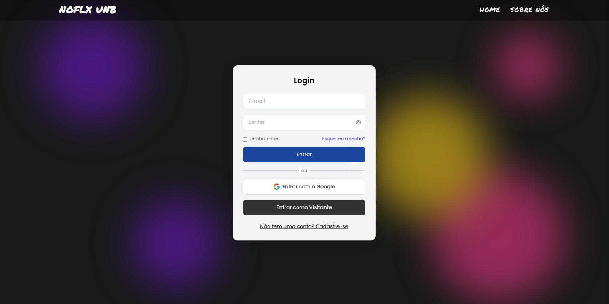
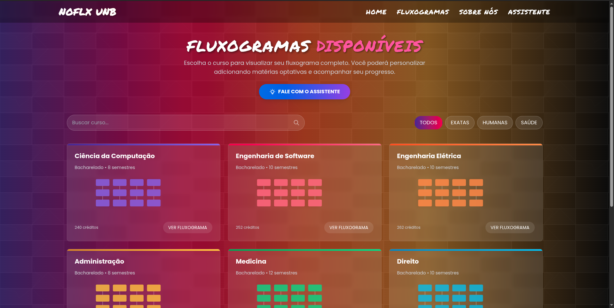
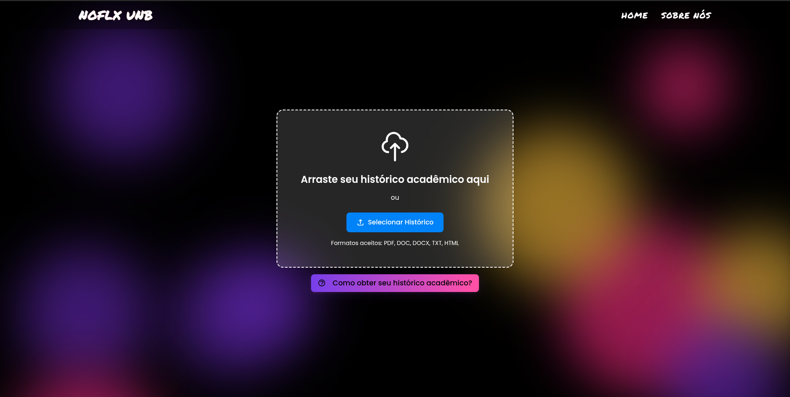

# 🎨 Documentação de Estilo - Interface Web

## 1. Fundos e Overlays
| Classe Tailwind          | Código HEX  | Tipo         | Uso típico               |
|--------------------------|-------------|--------------|--------------------------|
| `bg-black`               | `#000000`   | Fundo sólido | Corpo principal          |
| `bg-black bg-opacity-30` | `#0000004D` | Overlay      | Header/Navbar            |
| `bg-black bg-opacity-95` | `#000000F2` | Overlay      | Menu mobile              |
| `bg-white bg-opacity-10` | `#FFFFFF1A` | Card         | Seções transparentes     |

## 2. Tipografia
| Classe          | Código HEX | Peso visual | Aplicação               |
|-----------------|------------|-------------|-------------------------|
| `text-white`    | `#FFFFFF`  | Alto        | Títulos principais      |
| `text-gray-300` | `#D1D5DB`  | Médio       | Texto secundário        |
| `text-gray-400` | `#9CA3AF`  | Baixo       | Rodapé/terciário        |

## 3. Gradientes
### 3.1 Botões principais
- `from-purple-600 to-pink-600`  
  Código: `#9333EA → #DB2777`  
  Uso: Todos os CTAs principais

### 3.2 Efeitos hover
- `hover:from-purple-700 hover:to-pink-700`  
  Código: `#7E22CE → #BE185D`

## 5. Dispositivos (Mockup)
| Elemento       | Código HEX | Equivalente Tailwind |
|----------------|------------|----------------------|
| Base do laptop | `#333333`  | `bg-gray-800`        |
| Detalhes       | `#555555`  | `bg-gray-700`        |
| Tela           | `#F5F5F5`  | `bg-gray-50`         |

## 6. Bordas e Divisores
| Classe               | Código HEX  | Opacidade |
|----------------------|-------------|-----------|
| `border-white border-opacity-10` | `#FFFFFF`   | 10%       |
| `border-gray-700`    | `#374151`   | 100%      |

## Imagens do Protótipo

> **Figura 1**: Essa imagem mostra a página de login.
---

> **Figura 2**: Essa imagem mostra a HomePage.
---

> **Figura 3**: Essa imagem mostra a página de fluxograma.
---

> **Figura 4**: Essa imagem mostra a página do assistente ia.
---

> **Figura 5**: Essa imagem mostra a página para leitura do PDF.